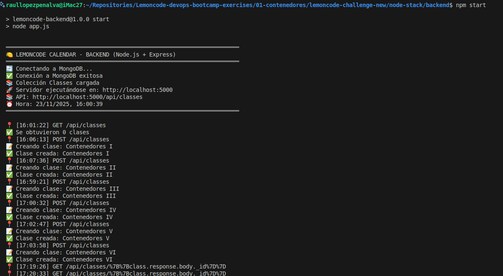
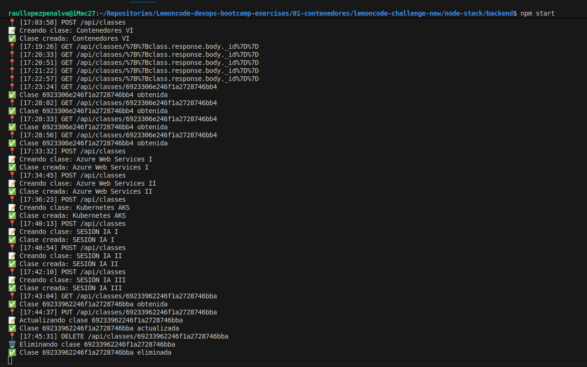

# Reto 1: Creación del contenedor MongoDB y conexion con el backend

## 1- Comando para crear la Docker network para el challenge

Aquí he creado una red con el nombre indicado para el challenge y de tipo driver. De forma automatica se establece el rango de subred y mascara.

```bash
docker network create --driver bridge lemoncode-challenge
```

## 2- Creamos el volumen persistente para el MongoDB

```bash
docker volume create some-mongoDB
```

## 3- Comando para ejecutar el contenedor MongoDB

Ejecuto el comando para hacer pull de la imagen MongoDB oficial con el tag :noble (por similitud de que mi host es un Ubuntu noble, pero he visto que el tag :latest es el mismo que el noble para amd64).

Pongo de nombre del contenedor `some-mongo` que es el que exige el challenge y ademas es el mismo que usan en la documentacion de la imagen oficial.

Expongo el puerto `27017` que es el por default de mongo y el que exige el challenge para así poder conectarse el backend que corre en el host local.

Enlazo el volumen `some-mongoDB` que he creando anteriormente con la ruta `/data/db` del contenedor.

Ordeno que se conecte en la red Docker `lemoncode-challenge`.

```bash
docker run \
--name some-mongo \
-p 27017:27017 \
-v some-mongoDB:/data/db \
--network lemoncode-challenge \
-d \
mongo:noble
```
## 4- Arrancar backend (node.js) en local

Compruebo la configuracion en el archivo `app.js` del backend.

```javascript
// ============================================
// CONFIGURACIÓN
// ============================================
const DB_URL = process.env.DATABASE_URL || 'mongodb://localhost:27017';
const DB_NAME = process.env.DATABASE_NAME || 'ClassesDb';
const HOST = process.env.HOST || '0.0.0.0';
const PORT = process.env.PORT || 5000;
```
Observo que la configuracion por defecto es correcta para que funcione la conexión a Mongo ya que el backend lo estoy ejecutando en local y el contenedor de mongo tiene publico el puerto necesario. También observo que podría usar la api desde otro equipo de mi red LAN ya que puede recibir peticiones de cualquier IP (0.0.0.0).

Voy a la carpeta donde estan el `package.json` del backend y ejecuto el comando:
```bash
npm install
```
Con esto instalo las dependencias necesarias para poder correr el backend

Despues ejecuto el backend con:
```bash
npm start
```
## 5- Comprobaciones del CRUD

A continuacion muestro las pruebas realizadas con Rest client.

### 5.1 - GET all classes


`GET {{host}}/api/classes`


**Response:**

```
HTTP/1.1 200 OK
X-Powered-By: Express
Access-Control-Allow-Origin: *
Content-Type: application/json; charset=utf-8
Content-Length: 2
ETag: W/"2-l9Fw4VUO7kr8CvBlt4zaMCqXZ0w"
Date: Sun, 23 Nov 2025 15:01:22 GMT
Connection: close

[]
```
### 5.2 - Session 1

POST {{host}}/api/classes
Content-Type: application/json

{
  "name": "Contenedores I",
  "instructor": "Gisela Torres",
  "startDate": "2025-10-17T18:00:00Z",
  "endDate": "2025-10-17T20:00:00Z",
  "duration": 2,
  "level": "Beginner"
}

**Response:**
```
HTTP/1.1 201 Created
X-Powered-By: Express
Access-Control-Allow-Origin: *
Content-Type: application/json; charset=utf-8
Content-Length: 187
ETag: W/"bb-IHIvYxHY/naN1osGVVDqG8SRN58"
Date: Sun, 23 Nov 2025 15:06:13 GMT
Connection: close

{
  "_id": "692322e5246f1a2728746baf",
  "name": "Contenedores I",
  "instructor": "Gisela Torres",
  "startDate": "2025-10-17T18:00:00Z",
  "endDate": "2025-10-17T20:00:00Z",
  "duration": 2,
  "level": "Beginner"
}
```
### 5.3 - Session 2

POST {{host}}/api/classes
Content-Type: application/json

{
  "name": "Contenedores II",
  "instructor": "Gisela Torres",
  "startDate": "2025-10-24T18:00:00Z",
  "endDate": "2025-10-24T20:00:00Z",
  "duration": 2,
  "level": "Beginner"
}

**Response:**
```
HTTP/1.1 201 Created
X-Powered-By: Express
Access-Control-Allow-Origin: *
Content-Type: application/json; charset=utf-8
Content-Length: 188
ETag: W/"bc-Fwn+fi4C04hhPzMeWTCdJfpz+2M"
Date: Sun, 23 Nov 2025 15:07:36 GMT
Connection: close

{
  "_id": "69232338246f1a2728746bb0",
  "name": "Contenedores II",
  "instructor": "Gisela Torres",
  "startDate": "2025-10-24T18:00:00Z",
  "endDate": "2025-10-24T20:00:00Z",
  "duration": 2,
  "level": "Beginner"
}
```
### 5.4 - Session 3

POST {{host}}/api/classes
Content-Type: application/json

{
  "name": "Contenedores III",
  "instructor": "Gisela Torres",
  "startDate": "2025-10-31T18:00:00Z",
  "endDate": "2025-10-31T20:00:00Z",
  "duration": 2,
  "level": "Beginner"
}

**Response:**
```
HTTP/1.1 201 Created
X-Powered-By: Express
Access-Control-Allow-Origin: *
Content-Type: application/json; charset=utf-8
Content-Length: 189
ETag: W/"bd-9G4wBPZF/hG6hYkj7W1+flX5w3I"
Date: Sun, 23 Nov 2025 15:59:21 GMT
Connection: close

{
  "_id": "69232f59246f1a2728746bb1",
  "name": "Contenedores III",
  "instructor": "Gisela Torres",
  "startDate": "2025-10-31T18:00:00Z",
  "endDate": "2025-10-31T20:00:00Z",
  "duration": 2,
  "level": "Beginner"
}
```

### 5.5 - Session 4

POST {{host}}/api/classes
Content-Type: application/json

{
  "name": "Contenedores IV",
  "instructor": "Gisela Torres",
  "startDate": "2025-11-07T18:00:00Z",
  "endDate": "2025-11-07T20:00:00Z",
  "duration": 2,
  "level": "Beginner"
}

**Response:**
```
HTTP/1.1 201 Created
X-Powered-By: Express
Access-Control-Allow-Origin: *
Content-Type: application/json; charset=utf-8
Content-Length: 188
ETag: W/"bc-qqOOiloyhwWzbzQTlO7EEFadNYc"
Date: Sun, 23 Nov 2025 16:00:32 GMT
Connection: close

{
  "_id": "69232fa0246f1a2728746bb2",
  "name": "Contenedores IV",
  "instructor": "Gisela Torres",
  "startDate": "2025-11-07T18:00:00Z",
  "endDate": "2025-11-07T20:00:00Z",
  "duration": 2,
  "level": "Beginner"
}
```

### 5.6 - Session 5

POST {{host}}/api/classes
Content-Type: application/json

{
  "name": "Contenedores V",
  "instructor": "Gisela Torres",
  "startDate": "2025-11-14T18:00:00Z",
  "endDate": "2025-11-14T20:00:00Z",
  "duration": 2,
  "level": "Beginner"
}

**Response:**
```
HTTP/1.1 201 Created
X-Powered-By: Express
Access-Control-Allow-Origin: *
Content-Type: application/json; charset=utf-8
Content-Length: 187
ETag: W/"bb-o3m9GmArZ+sGjMu/gOujcwhUoeY"
Date: Sun, 23 Nov 2025 16:02:47 GMT
Connection: close

{
  "_id": "69233027246f1a2728746bb3",
  "name": "Contenedores V",
  "instructor": "Gisela Torres",
  "startDate": "2025-11-14T18:00:00Z",
  "endDate": "2025-11-14T20:00:00Z",
  "duration": 2,
  "level": "Beginner"
}
```

### 5.7 - Session 6

POST {{host}}/api/classes
Content-Type: application/json

{
  "name": "Contenedores VI",
  "instructor": "Gisela Torres",
  "startDate": "2025-11-21T18:00:00Z",
  "endDate": "2025-11-21T20:00:00Z",
  "duration": 2,
  "level": "Beginner"
}

**Response:**
```
HTTP/1.1 201 Created
X-Powered-By: Express
Access-Control-Allow-Origin: *
Content-Type: application/json; charset=utf-8
Content-Length: 188
ETag: W/"bc-YgZD+ulerlV3VLPBZ5B2f/TEU1I"
Date: Sun, 23 Nov 2025 16:03:58 GMT
Connection: close

{
  "_id": "6923306e246f1a2728746bb4",
  "name": "Contenedores VI",
  "instructor": "Gisela Torres",
  "startDate": "2025-11-21T18:00:00Z",
  "endDate": "2025-11-21T20:00:00Z",
  "duration": 2,
  "level": "Beginner"
}
```
### 5.8 - Session 7

POST {{host}}/api/classes
Content-Type: application/json

{
  "name": "Azure Web Services I",
  "instructor": "Gisela Torres",
  "startDate": "2026-02-20T18:00:00Z",
  "endDate": "2026-02-20T20:00:00Z",
  "duration": 2,
  "level": "Beginner"
}

**Response:**
```
HTTP/1.1 201 Created
X-Powered-By: Express
Access-Control-Allow-Origin: *
Content-Type: application/json; charset=utf-8
Content-Length: 193
ETag: W/"c1-iP7iAMJjNAWZMFApydEw6UzTz8U"
Date: Sun, 23 Nov 2025 16:33:32 GMT
Connection: close

{
  "_id": "6923375c246f1a2728746bb5",
  "name": "Azure Web Services I",
  "instructor": "Gisela Torres",
  "startDate": "2026-02-20T18:00:00Z",
  "endDate": "2026-02-20T20:00:00Z",
  "duration": 2,
  "level": "Beginner"
}
```
### 5.9 - Session 8

POST {{host}}/api/classes
Content-Type: application/json

{
  "name": "Azure Web Services II",
  "instructor": "Gisela Torres",
  "startDate": "2026-02-27T18:00:00Z",
  "endDate": "2026-02-27T20:00:00Z",
  "duration": 2,
  "level": "Beginner"
}

**Response:**
```
HTTP/1.1 201 Created
X-Powered-By: Express
Access-Control-Allow-Origin: *
Content-Type: application/json; charset=utf-8
Content-Length: 194
ETag: W/"c2-BdKf7m3gGUnyc/uL60PLOZAc7Ps"
Date: Sun, 23 Nov 2025 16:34:45 GMT
Connection: close

{
  "_id": "692337a5246f1a2728746bb6",
  "name": "Azure Web Services II",
  "instructor": "Gisela Torres",
  "startDate": "2026-02-27T18:00:00Z",
  "endDate": "2026-02-27T20:00:00Z",
  "duration": 2,
  "level": "Beginner"
}
```
### 5.10 - Session 9

POST {{host}}/api/classes
Content-Type: application/json

{
  "name": "Kubernetes AKS",
  "instructor": "Gisela Torres",
  "startDate": "2026-03-13T18:00:00Z",
  "endDate": "2026-03-13T20:00:00Z",
  "duration": 2,
  "level": "Beginner"
}

**Response:**
```
HTTP/1.1 201 Created
X-Powered-By: Express
Access-Control-Allow-Origin: *
Content-Type: application/json; charset=utf-8
Content-Length: 187
ETag: W/"bb-tDcomwNCTQbVmsqqxuXW94DyOvM"
Date: Sun, 23 Nov 2025 16:36:23 GMT
Connection: close

{
  "_id": "69233807246f1a2728746bb7",
  "name": "Kubernetes AKS",
  "instructor": "Gisela Torres",
  "startDate": "2026-03-13T18:00:00Z",
  "endDate": "2026-03-13T20:00:00Z",
  "duration": 2,
  "level": "Beginner"
}
```
### 5.11 - Session 10

POST {{host}}/api/classes
Content-Type: application/json

{
  "name": "SESIÓN IA I",
  "instructor": "Gisela Torres",
  "startDate": "2026-04-17T18:00:00Z",
  "endDate": "2026-04-17T20:00:00Z",
  "duration": 2,
  "level": "Beginner"
}

**Response:**
```
HTTP/1.1 201 Created
X-Powered-By: Express
Access-Control-Allow-Origin: *
Content-Type: application/json; charset=utf-8
Content-Length: 185
ETag: W/"b9-M6n0J7npwU3VSfWc207xU+tlAS4"
Date: Sun, 23 Nov 2025 16:40:13 GMT
Connection: close

{
  "_id": "692338ed246f1a2728746bb8",
  "name": "SESIÓN IA I",
  "instructor": "Gisela Torres",
  "startDate": "2026-04-17T18:00:00Z",
  "endDate": "2026-04-17T20:00:00Z",
  "duration": 2,
  "level": "Beginner"
}
```
### 5.12 - Session 11

POST {{host}}/api/classes
Content-Type: application/json

{
  "name": "SESIÓN IA II",
  "instructor": "Gisela Torres",
  "startDate": "2026-04-24T18:00:00Z",
  "endDate": "2026-04-24T20:00:00Z",
  "duration": 2,
  "level": "Beginner"
}

**Response:**
```
HTTP/1.1 201 Created
X-Powered-By: Express
Access-Control-Allow-Origin: *
Content-Type: application/json; charset=utf-8
Content-Length: 186
ETag: W/"ba-/6ZK9QcPpv/m5IE8/m1zpc3UnwA"
Date: Sun, 23 Nov 2025 16:40:54 GMT
Connection: close

{
  "_id": "69233916246f1a2728746bb9",
  "name": "SESIÓN IA II",
  "instructor": "Gisela Torres",
  "startDate": "2026-04-24T18:00:00Z",
  "endDate": "2026-04-24T20:00:00Z",
  "duration": 2,
  "level": "Beginner"
}
```
### 5.13 - Session 12

POST {{host}}/api/classes
Content-Type: application/json

{
  "name": "SESIÓN IA III",
  "instructor": "Gisela Torres",
  "startDate": "2026-05-01T18:00:00Z",
  "endDate": "2026-05-01T20:00:00Z",
  "duration": 2,
  "level": "Beginner"
}

**Response:**
```
HTTP/1.1 201 Created
X-Powered-By: Express
Access-Control-Allow-Origin: *
Content-Type: application/json; charset=utf-8
Content-Length: 187
ETag: W/"bb-O3HUtFVHy+08Q1lbY1n2bfxe/bk"
Date: Sun, 23 Nov 2025 16:42:10 GMT
Connection: close

{
  "_id": "69233962246f1a2728746bba",
  "name": "SESIÓN IA III",
  "instructor": "Gisela Torres",
  "startDate": "2026-05-01T18:00:00Z",
  "endDate": "2026-05-01T20:00:00Z",
  "duration": 2,
  "level": "Beginner"
}
```
### 5.14 - Get a class by ID (replace {id} with actual ID)

GET {{host}}/api/classes/{{classId}}

**Response:**
```
HTTP/1.1 200 OK
X-Powered-By: Express
Access-Control-Allow-Origin: *
Content-Type: application/json; charset=utf-8
Content-Length: 187
ETag: W/"bb-O3HUtFVHy+08Q1lbY1n2bfxe/bk"
Date: Sun, 23 Nov 2025 16:43:04 GMT
Connection: close

{
  "_id": "69233962246f1a2728746bba",
  "name": "SESIÓN IA III",
  "instructor": "Gisela Torres",
  "startDate": "2026-05-01T18:00:00Z",
  "endDate": "2026-05-01T20:00:00Z",
  "duration": 2,
  "level": "Beginner"
}
```
### 5.15 - Update a class (replace {id} with actual ID)

PUT {{host}}/api/classes/{{classId}}
Content-Type: application/json

{
  "name": "Updated Class Name",
  "instructor": "New Instructor",
  "startDate": "2025-10-17T18:00:00Z",
  "endDate": "2025-10-17T20:00:00Z",
  "duration": 2,
  "level": "Intermediate"
}

**Response:**
```
HTTP/1.1 200 OK
X-Powered-By: Express
Access-Control-Allow-Origin: *
Content-Type: application/json; charset=utf-8
Content-Length: 196
ETag: W/"c4-rF+mhBcYd68QbMoQ2yOwjb+uuEk"
Date: Sun, 23 Nov 2025 16:44:37 GMT
Connection: close

{
  "_id": "69233962246f1a2728746bba",
  "name": "Updated Class Name",
  "instructor": "New Instructor",
  "startDate": "2025-10-17T18:00:00Z",
  "endDate": "2025-10-17T20:00:00Z",
  "duration": 2,
  "level": "Intermediate"
}
```
### 5.16 - Delete a class (replace {id} with actual ID)

DELETE {{host}}/api/classes/{{classId}}

**Response:**
```
HTTP/1.1 204 No Content
X-Powered-By: Express
Access-Control-Allow-Origin: *
Date: Sun, 23 Nov 2025 16:45:31 GMT
Connection: close

```
## 6 - Backend logs screenshot



