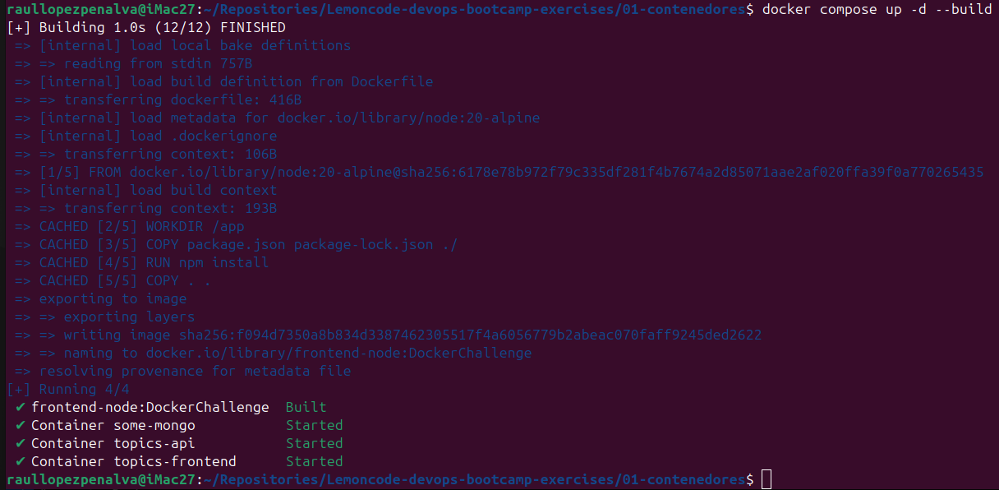
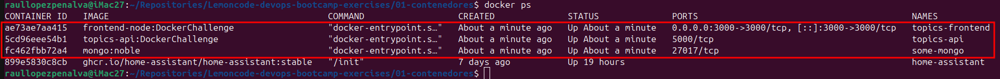
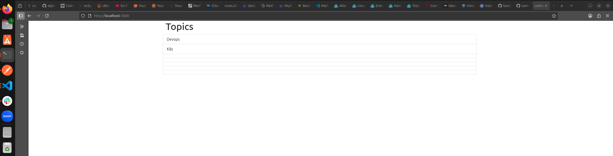

# Reto 4: Docker Compose - Todo junto

## 1- compose.yml

Creo el archivo [compose.yml](compose.yml) en el directorio raiz del repositorio del laboratorio, dentro de este direcotorio están los directorios del node-stack con frontend y backend. 
Dentro de cada directorio de frontend y backend tiene su `Dockerfile` y su archivo archivo `.env` para definir variables de entorno en el compose.

[Dockerfile_backend](./lemoncode-challenge/node-stack/backend/Dockerfile)

[Dockerfile_frontend](./lemoncode-challenge/node-stack/frontend/Dockerfile
)

[Archivo_.env_backend](./lemoncode-challenge/node-stack/backend/.env
)

[Archivo_.env_frontend](./lemoncode-challenge/node-stack/frontend/.env)

**Docker compose file:**
```yaml
# a partir de services: creas los servicios
services:
  # Definición del servicio de MongoDB
  some-mongo:
    image: mongo:noble
    container_name: some-mongo
    # Solo indico que el puerto 27017 está expuesto para otros servicios pero no está publico en el host, solo es accesible desde la red de docker
    expose:
      - "27017"
    # Conexión a la red definida más abajo
    networks:
      - lemoncode-challenge
    # Definición del volumen para persistencia de datos
    volumes:
      - some-mongoDB:/data/db

 # Definición del servicio del Classes API (backend) 
  classes-api:
    # Uso la imagen que he creado en el reto anterior
    image: classes-api:DockerChallenge
    container_name: classes-api
    # Solo indico que el puerto 5000 está expuesto para otros servicios pero no está publico en el host, solo es accesible desde la red de docker
    expose:
      - "5000"
    # Variables de entorno desde archivo .env para el servicio del backend
    env_file:
      - ./lemoncode-challenge/node-stack/backend/.env
    # Conexión a la red definida más abajo
    networks:
      - lemoncode-challenge
    # Indico que este servicio depende de que el servicio some-mongo esté levantado
    depends_on:
      - some-mongo 
  
  # Definición del servicio del Classes Frontend
  classes-frontend:
    # Para demostrar que se puede construir la imagen desde el dockerfile en el propio compose sin necesidad de crearla antes manualmente
    build:
      # Ruta para definir la ruta en la que trabajar y nombre del dockerfile(podria ser otro nombre distinto a Dockerfile)
      context: ./lemoncode-challenge/node-stack/frontend
      dockerfile: Dockerfile
    # Especifico el nombre de la imagen que se va a crear
    image: frontend-node:DockerChallenge
    container_name: classes-frontend
    # Mapeo del puerto 3000 del contenedor al puerto 3000 del host
    ports:
      - "3000:3000"
    # Variables de entorno desde archivo .env para el servicio del frontend
    env_file:
      - ./lemoncode-challenge/node-stack/frontend/.env
    # Conexión a la red definida más abajo
    networks:
      - lemoncode-challenge
    # Indico que este servicio depende de que el servicio classes-api esté levantado
    depends_on:
      - classes-api

# Definición de la red personalizada, ya está creada de los retos anteriores, por eso es external: true 
networks:
  lemoncode-challenge:
    external: true

# Definición de los volúmenes para persistencia de datos, tambien ya está creado de los retos anteriores, por eso es external: true
volumes:
  some-mongoDB:
    external: true
```

## 2- Variables de entorno

Para el Reto 4 de orquestar con docker compose, he utilizado también archivo de variables de entorno para el contenedor de backend. La ruta para llegar a cada archivo `.env` es relativa desde el punto desde donde está e archivo `compose.yml` ya que para hacer `docker compose up` y que use el archivo correcto debes estar en el directorio donde se encuentra el archivo `compose.yml`.

**Backend `.env`:**
```bash
DATABASE_URL=mongodb://some-mongo:27017
```

**Frontend `.env`:**
```bash
API_URL=http://classes-api:5000/api/classes
```

## 3- Resultado comando `docker compose up -d --build`

He utilizado los argumentos `-d`para que no se quede en el terminal y `--build` para que cree la imagen que se expecifica dentro del archivo `compose.yml`(mi duda es si es necesario usar este argumento si ya el archivo lo espeficia?).





## 4- Resultado `docker ps`



## 5- Captura app

