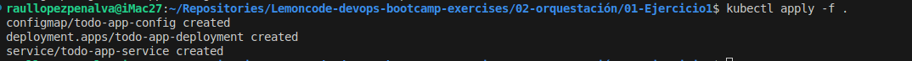
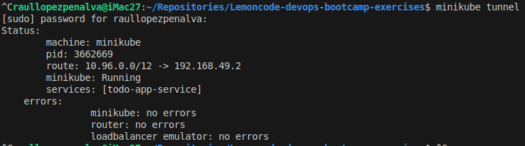
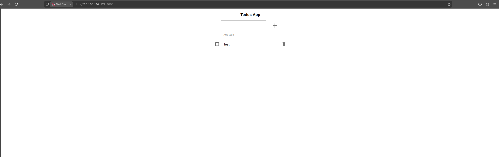

# Ejercicio 1: Monolito en memoria

## 1- ConfigMap para meter variables de entorno a los pods

He creado un archivo YAML para crear un ConfigMap con las variables de entorno para todo-app del ejercicio. Las variables de entorno son las siguientes:
```bash
ENV_NODE=production
PORT=3000
```

[ConfigMag File](cgm-todo-app.yaml)

```yaml
apiVersion: v1
kind: ConfigMap
metadata:
  name: cgm-todo-app-config
  labels:
    app: todo-app
data:
  NODE_ENV: "production"
  PORT: "3000"
```

## 2- Deployment de todo-app

He creado un archivo YAML que describe el deploy de 3 replicas para un pod con todo-app y cargando el configmap.

[Deployment File](deploy-todo-app.yaml)

```yaml
apiVersion: apps/v1
kind: Deployment
metadata:
  name: todo-app-deployment
  labels:
    app: todo-app
spec:
  replicas: 3
  selector:
    matchLabels:
      app: todo-app
  template:
    metadata:
      labels:
        app: todo-app
    spec:
      containers:
        - name: todo-app-container
          image: lemoncodersbc/lc-todo-monolith:v5-2024
          ports:
            - containerPort: 3000
          envFrom:
            - configMapRef:
                name: cgm-todo-app-config
```

## 3- Service para todo-app de tipo *LoadBalancer*

He creado un archivo tipo YAML par describir el servicio que enrutará las peticiones desde fuera a los pods con todo-app. El servicio es de tipo *LoadBalancer* para poder exponerlo con un balanceador externo.

[Service File](svc-todo-app.yaml)

```yaml
apiVersion: v1
kind: Service
metadata:
  name: todo-app-service
  labels:
    app: todo-app
spec:
  selector:
    app: todo-app
  ports:
    - protocol: TCP
      port: 3000
      targetPort: 3000
  type: LoadBalancer
```
## 4- Aplicar las configuraciones al cluster

Despues de crear los archivos YAML con las declaraciones de como quiero que actue el cluster, ejecuto el comando para poder declararlos en el cluster.

```bash
kubectl apply -f .
```
Salida del comando:



## 5- Activación del tunnel

Minikube tiene una opcion donde puedes crear tuneles que simila el tunel que habria entre un *LoadBalancer* externo y el cluster, pero simplemente puedes comprobar que funciona apuntando en tu navegador a la ip que expone el tunel y comprobar que entra al servicio deseado.

Comando para activar el tunnel:
```bash
minikube tunnel
```
Salida del comando:



## 6- Comprobacion que funciona

Compruebo que el servicio está expuesto usando el comando:
```bash
kubectl get svc
```


Observamos que el servicio `todo-app-service` se está exponiendo por el tunnel con la IP `10.105.12.122` por el puerto 3000.


Entro por browser a la IP expuesta por el puerto confogirado y observamos que funciona correctamente

