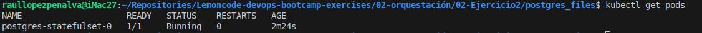
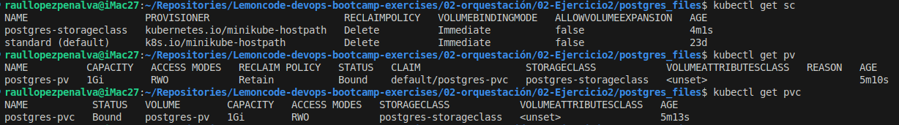
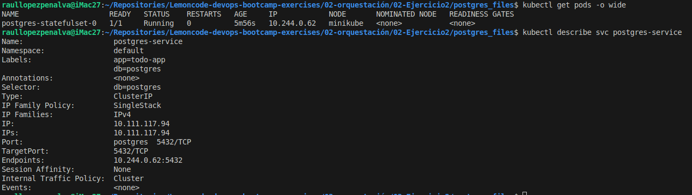
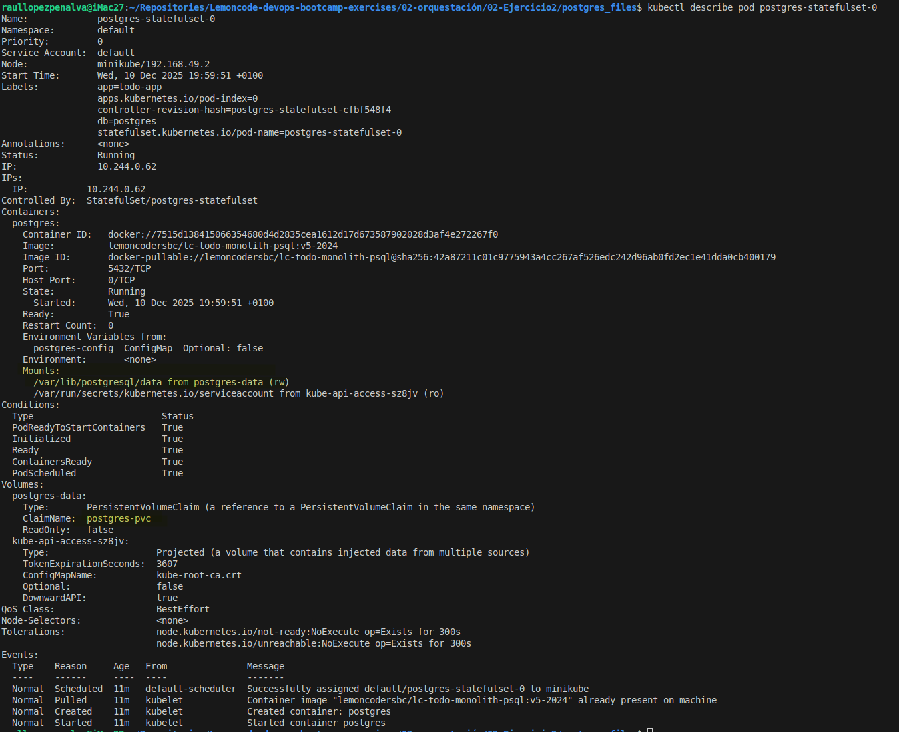
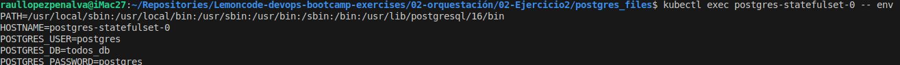
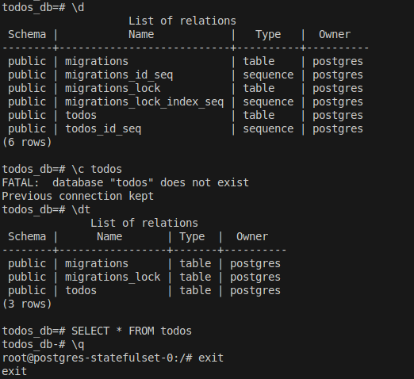
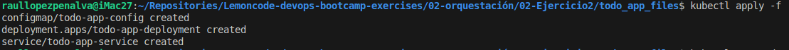
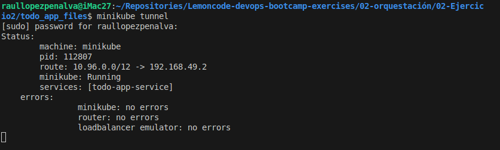
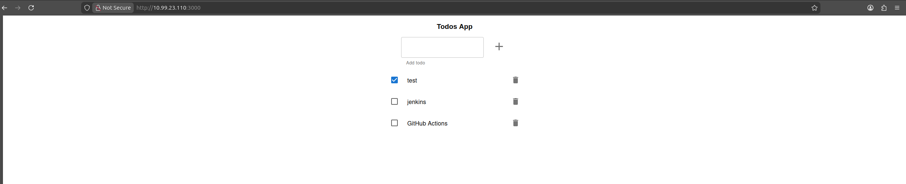
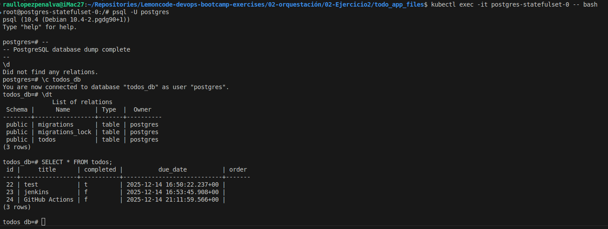

# Ejercicio 2: Monolito con persistencia de datos


## Paso 1: Crear una capa de persistencia de datos

### 1- Creación del configMap de postgres

He creado un configMap con las variables de entorno necesarias para configurar el pod que corre postgres.

```bash
POSTGRES_DB=todos_db
POSTGRES_USER=postgres
POSTGRES_PASSWORD=postgres
```
[ConfigMag File](./postgres_files/configMap-ENV-postgres.yaml)

```yaml
apiVersion: v1
kind: ConfigMap
metadata:
  name: postgres-config
  labels:
    db: postgres
    app: todo-app
data:
  POSTGRES_DB: todos_db
  POSTGRES_USER: postgres
  POSTGRES_PASSWORD: postgres
```

### 2- Creación del storageclass

He creado un YAML para definir el storageclass para el volumen persistente que usará postgres. Minikube ya tiene un storageclass definido por defecto que es de tipo hostpath pero he creado este que es practicamente lo mismo que al default para poder entender la sintaxis de la deifinion de un storageclass.

[storageclass postgres file](./postgres_files/sc-postgres.yaml)

```yaml
apiVersion: storage.k8s.io/v1
kind: StorageClass
metadata:
  name: postgres-storageclass
  labels:
    db: postgres
    app: todo-app
provisioner: kubernetes.io/minikube-hostpath
```
### 3- Creación del volumen persistente

He creado un YAML para definir el volumen persistente para postgres. He de comentar que si se hace aprovisionamiento dinamico no hace falta definir el PV previamente. 

[Postgres PV File](./postgres_files/pv-postgres.yaml)

```yaml
apiVersion: v1
kind: PersistentVolume
metadata:
  name: postgres-pv
  labels:
    db: postgres
    app: todo-app
spec:
  accessModes:
    - ReadWriteOnce
  capacity:
    storage: 1Gi
  storageClassName: postgres-storageclass
  hostPath:
    path: /mnt/data/postgres
```
### 4- Creación del Persistent Volumen Claim

He creado un YAML que define el PVC para postgres usando el storageclass definido antes. Por consecuencia como el PV anterior tiene el mismo storageclass Kubernetes asignará el PVC con el PV anterior por correlación de caracteristicas y por que el PV está libre.

[Postgres PVC File](./postgres_files/pvc-postgres.yaml)

```yaml
apiVersion: v1
kind: PersistentVolumeClaim
metadata:
  name: postgres-pvc
  labels:
    db: postgres
    app: todo-app
spec:
  resources:
    requests:
      storage: 1Gi
  volumeMode: Filesystem
  accessModes:
    - ReadWriteOnce
  storageClassName: postgres-storageclass
```

### 5- Creación Cluster IP service para postgres

He creado un YAML que define el service que se encarga de direccionar las peticiones a los pods de postgres. En este caso solo se hace un replica de postgres para no configurar el sharing para postgres.

[Cluster IP service File](./postgres_files/svc-postgres.yaml)

```yaml
apiVersion: v1
kind: Service
metadata:
  name: postgres-service
  labels:
    db: postgres
    app: todo-app
spec:
  type: ClusterIP
  selector:
    db: postgres
  ports:
    - port: 5432
      targetPort: 5432
      protocol: TCP
      name: postgres
```

### 6- Creación del StatefulSet

Despues de haber creado todo lo anterior se crea el statefulSet donde crearemos los pods con estado para poder gestionar la persistencia de datos de estos pods. El statefulSet utiliza de forma directa o indirecta todos los objetos creados previamente. He usado la imagen de postgres:10.4 ya que el script de SQL está optimizado a esta versión.

[StatefulSet File](./postgres_files/statefulSet-postgres.yaml)

```yaml
apiVersion: apps/v1
kind: StatefulSet
metadata:
  name: postgres-statefulset
  labels:
    db: postgres
spec:
  serviceName: "postgres-service"
  replicas: 1
  selector:
    matchLabels:
      db: postgres
  template:
    metadata:
      labels:
        db: postgres
    spec:
      containers:
      - name: postgres
        image: postgres:10.4
        ports:
        - containerPort: 5432
        envFrom:
        - configMapRef:
            name: postgres-config
        volumeMounts:
        - name: postgres-data
          mountPath: /var/lib/postgresql/data
      volumes:
      - name: postgres-data
        persistentVolumeClaim:
          claimName: postgres-pvc
```
### 7- Cargar el script de SQL

He cargado manualmente el script de `todos_db.sql`.

### 8- Resultado y comprobaciones

Aplico los YAMLs para crear el servicio postgres con el siguiente comando:

```bash
cd postgres_files
kubectl apply -f .
```

Output del comando:


Observamos que existe el pod de postgres y running:


Storageclass, PV y PVC creados y funcionando:


Compruebo que se ha creado el servico y ha cogido de endpoint en pod de postgres:


Podemos observar (amarillo) en el describe del pod que ha montado el correctamente el PVC en el directorio correcto


Comprobamos que el pod a cargado correctamente las variables de entorno desde el configmap.


Comprobamos que se ha cargado bien el script de SQL.



## 2- Crear todo-app

### 1- Creacion ConfigMap

He creado un configMap con la variables de entorno para `todo-app`.

```bash
NODE_ENV=production
PORT=3000
DB_HOST=postgres-service
DB_PORT=5432
DB_USER=postgres
DB_PASSWORD=postgres
DB_NAME=todos_db
DB_VERSION=10.4
```
[ConfigMap File](./todo_app_files/cgm-todo-app.yaml)

```YAML
apiVersion: v1
kind: ConfigMap
metadata:
  name: todo-app-config
  labels:
    app: todo-app
data:
  NODE_ENV: "production"
  PORT: "3000"
  DB_HOST: "postgres-service"
  DB_PORT: "5432"
  DB_USER: "postgres"
  DB_PASSWORD: "postgres"
  DB_NAME: "todos_db"
  DB_VERSION: "10.4"
```
### 2- Creacion del service

He creado un servicio `LoadBalancer` para poder usar el tunel y conectarme a todo-app.

```YAML
apiVersion: v1
kind: Service
metadata:
  name: todo-app-service
  labels:
    app: todo-app
spec:
  selector:
    app: todo-app
  ports:
    - protocol: TCP
      port: 3000
      targetPort: 3000
  type: LoadBalancer
  ```

  ### 3- Creacion del deploy

  He creado un deploy donde especifico los pods para todo app.

  ```YAML
  apiVersion: apps/v1
kind: Deployment
metadata:
  name: todo-app-deployment
  labels:
    app: todo-app
spec:
  replicas: 2
  selector:
    matchLabels:
      app: todo-app
  template:
    metadata:
      labels:
        app: todo-app
    spec:
      containers:
        - name: todo-app-container
          image: lemoncodersbc/lc-todo-monolith-db:v5-2024
          ports:
            - containerPort: 3000
          envFrom:
            - configMapRef:
                name: todo-app-config
```
### 4- Aplico los files

```bash
cd todo_app_files
kubectl apply -f .
```
output comando


## 3- Entrar a todo app

Ejecuto el comando
```bash
minikube tunnel
```
Output:


Entro a `http://10.99.23.110:3000/` y puedo acceder a todo app. Registro tres entradas y parece ser que funciona.


Para comprobar que a registrado en la base de datos, entro por bash al pod de postgres y verifico las entradas.
