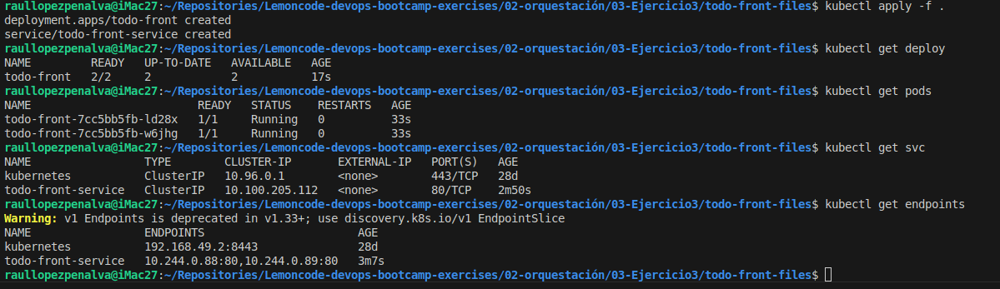
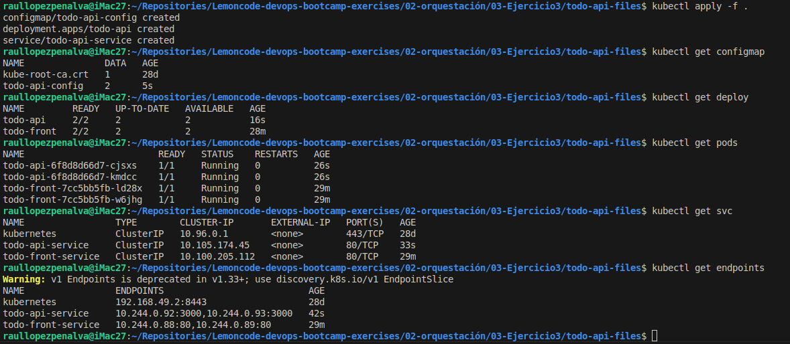
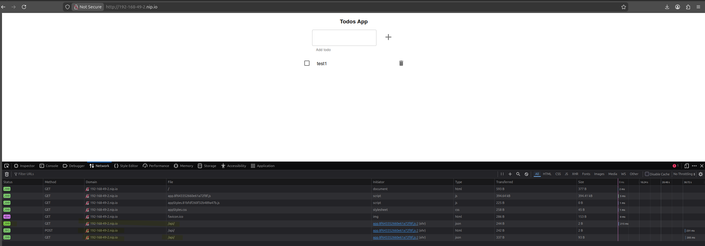
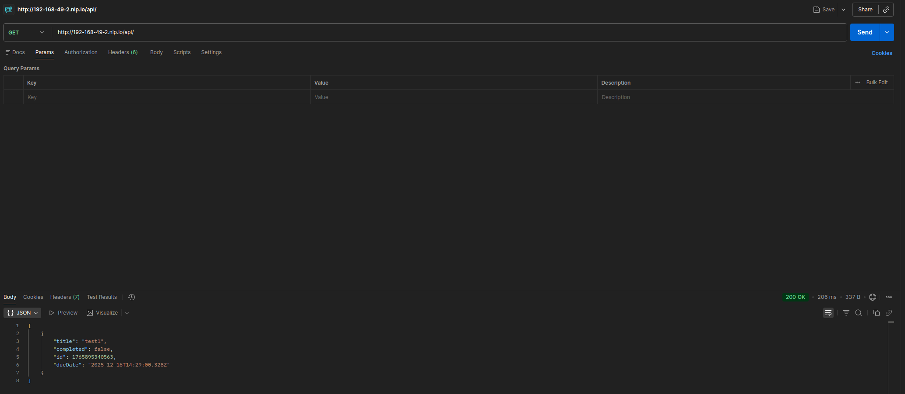

# Ejercicio 3: Ingress: App distribuida

## Login a mi GHCR

Para poder pull de las imagenes creadas desde mi repositorio privado he decir a minikube las credenciales de mi repo de `ghcr.io`. Para ello he configurado un secret tipo docker registry usando el siguiente comando:
```bash
kubectl create secret docker-registry myghcr-secret \
    --docker-server=ghcr.io \
    --docker-username=mi_usuario \
    --docker-password=MY_GHCR_TOKEN \
    --docker-email=mi@email.com\
    -n default
```


## Paso 1: Crear todo-front

### 1- Creación de la imagen y push a mi repositorio

Ejecuto el comando:
```bash
docker build -t ghcr.io/raullopezpenalva/todo-front:latest .
```
Hago push a mi repo
```bash
docker push ghcr.io/raullopezpenalva/todo-front:latest
```

### 2- Creación del deploy para todo-front

He configurado un archivo yaml para hacer el deploy de los pods que serviran `todo-front`.

[Deploy todo-front File](./todo-front-files/deploy-todo-front.yaml)

```yaml
apiVersion: apps/v1
kind: Deployment
metadata:
  name: todo-front
  labels:
    app: todo-front
spec:
  replicas: 2
  selector:
    matchLabels:
      app: todo-front
  template:
    metadata:
      labels:
        app: todo-front
    spec:
      imagePullSecrets:
      - name: myghcr-secret
      containers:
      - name: todo-front
        image: ghcr.io/raullopezpenalva/todo-front:latest
        ports:
        - containerPort: 80
        envFrom: 
        - configMapRef:
            name: todo-front-config
```
### 3- Creación del service para todo-front

He configurado un archivo yaml para crear el servicio para `todo-front`.

[Service todo-front File](./todo-front-files/svc-todo-front.yaml)

```yaml
apiVersion: v1
kind: Service
metadata:
  name: todo-front-service
  labels:
    app: todo-front
spec:
  type: ClusterIP
  selector:
    app: todo-front
  ports:
    - protocol: TCP
      port: 80
      targetPort: 80
```
### 4- Puesta en marcha y comprobaciones

Voy al directorio donde tengo los archivos para hacer el deploy de `todo-front` y ejecuto:
```bash
kubectl apply -f .
```
Comprobamos que funcionan los pods, pero no sabemos si carga bien el front, eso se comprobará con el ingress


## Paso 2: Crear todo-api

### 1- Creación de la imagen y push a mi repositorio

Ejecuto el comando:
```bash
docker build -t ghcr.io/raullopezpenalva/todo-api:latest .
```
Hago push a mi repo
```bash
docker push ghcr.io/raullopezpenalva/todo-api:latest
```

### 2- Creación del configMap para las variables de entorno de `todo-api`

He configurado un archivo yaml para cargar un configMap con la variables de entorno necesarias para `todo-api`.

[ConfigMap todo-api File](./todo-api-files/configMap-todo-api.yaml)

```yaml
apiVersion: v1
kind: ConfigMap
metadata:
  name: todo-api-config
  labels:
    app: todo-api
data:
  NODE_ENV: "production"
  PORT: "3000"
```

### 3- Creación del deploy para todo-api

He configurado un archivo yaml para hacer el deploy de los pods que serviran `todo-api`.

[Deploy todo-api File](./todo-api-files/deploy-todo-api.yaml)

```yaml
apiVersion: apps/v1
kind: Deployment
metadata:
  name: todo-api
  labels:
    app: todo-api
spec:
  replicas: 2
  selector:
    matchLabels:
      app: todo-api
  template:
    metadata:
      labels:
        app: todo-api
    spec:
      imagePullSecrets:
      - name: myghcr-secret
      containers:
      - name: todo-api
        image: ghcr.io/raullopezpenalva/todo-api:latest
        ports:
        - containerPort: 3000
        envFrom:
        - configMapRef:
            name: todo-api-config
```

### 5- Creación del service para todo-api

He configurado un archivo yaml para crear el servicio para `todo-api`.

[Service todo-api File](./todo-api-files/svc-todo-api.yaml)

```yaml
apiVersion: v1
kind: Service
metadata:
  name: todo-api-service
  labels:
    app: todo-api
spec:
  type: ClusterIP
  selector:
    app: todo-api
  ports:
    - protocol: TCP
      port: 80
      targetPort: 3000
```

**NOTA** 
Como se puede observar en el yaml anterior. Especifico que el service se expone por el puerto 80 (http) pero el puerto `target` es el 3000 que es el que escuchan los pods de `todo-api`. Esto lo hago para que desde el browser ataque tanto al frontend como a la api por el mismo puerto y no sea necesario especificar puertos alternativos, sino que para el usario final y la entrada al ingress y al servicio de `todo-api` y `todo-fron` sea estandar.
También se podría cambiar el puerto del Node del pod por variables de entorno en el configMap.

### 5- Puesta en marcha y comprobaciones

Voy al directorio donde tengo los archivos para hacer el deploy de `todo-api` y ejecuto:
```bash
kubectl apply -f .
```
Comprobamos que funcionan los pods.


## Paso 3: Crear un Ingress para acceder a los servicios del clúster

Previamente a configurar el Ingress, en minikube he habilitado el addon de ingress, que es un ingress basado en nginx de Kubernetes.

Haciendo pruebas con `minikube tunnel` he podido comprobar que como el servicio que crea minikube de ingress-nginx es de tipo `NodePort`, y no de tipo `LoadBalancer`, no funciona de esta manera para poder acceder al cluster/ingress desde fuera del cluster(host).
En consecuencia he comprobado la IP que expone minikube con el comando `minikube ip` dando como output `192.168.49.2`. Para poder acceder al ingress se ha acceder por esa IP, pero para poder comprobar el funcionamiento de ingress mediante host personalizados
he utilzado el dns `0-0-0-0.nip.io` cambiandolo a `192-168-49-2.nip.io` para que cuando reciba peticiones a ese host re-direccione a los pods correctos y rechazando los que no cumplen.

[ingress-todo-app File](./ingress-files/ingress-todo-app.yaml)

```yaml
apiVersion: networking.k8s.io/v1
kind: Ingress
metadata:
  name: todo-app-ingress
  labels:
    app: todo-app
spec:
  rules:
  - host: 192-168-49-2.nip.io
    http:
      paths:
      - path: / 
        pathType: Prefix
        backend:
          service:
            name: todo-front-service
            port:
              number: 80
      - path: /api
        pathType: Prefix
        backend:
          service:
            name: todo-api-service
            port:
              number: 80
```
Aplico el yaml de ingress:
```bash
kubectl apply -f .
```

Para comprobar que funciona correctamente entro en `http://192-168-49-2.nip.io/` por browser, verifico que responde con `todo-front` entro al entorno Developer del browser y en la seccion Network compruebo las peticiones a la api, compriebo que responde `200` la api para hacer el `GET all` nada mas cargar la pagina. Despues inserto una entrada y compruebo como hace `POST`y desvulve un `201` de creación del objeto y vuelve a hacer un `GET all` para volver a mostrar el contenido de la API.



Compruebo com Postman `todo-api` haciendo un GET y responde de forma correcta.
